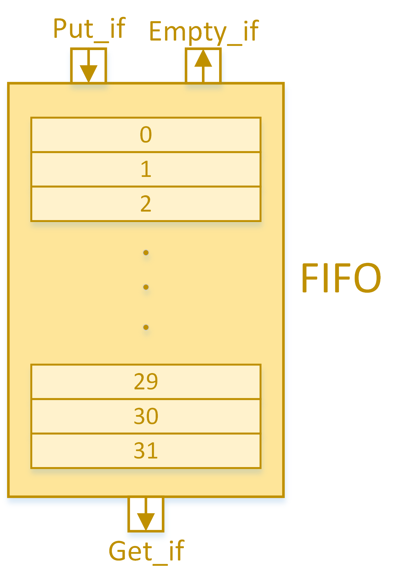

# High-Level Embedded System Model in SystemC

Welcome to the high-level model of an embedded system created using SystemC. This project includes detailed documentation and illustrations to clarify the design, making it ideal for learning and demonstrating system components and their interactions. The model integrates a **processor**, **memory**, **FIFO-based communication channel**, **intermediate component**, and **16-bit multiplier**, each with its unique functionality and interactions within the system.

## Table of Contents

1. [Project Overview](#project-overview)
2. [System Components](#system-components)
   - [Memory](#memory)
   - [Bus](#bus)
   - [FIFO Channel](#fifo-channel)
   - [Intermediate Component and Multiplier](#intermediate-component-and-multiplier)
   - [Processor](#processor)
3. [System Flow](#system-flow)
4. [Illustrations](#illustrations)
5. [Getting Started](#getting-started)
6. [Testing](#testing)
7. [Conclusion](#conclusion)

## Project Overview

This project aims to design and simulate a complete system at a high abstraction level before implementing components at the RT level. This model demonstrates how SystemC can be used for building complex systems efficiently. Each component has been designed with modularity in mind, allowing seamless integration and detailed testing through various test benches.

## System Components

### Memory

The memory module serves as the primary data storage. It includes:

- **Registers**: Controlled by `Memread` and `Memwrite` signals for reading and writing.
- **Initialization and Data Dumping**: Memory can be initialized from an external file, and the final state can be dumped for verification.

### Bus

The bus facilitates communication between the processor and memory, managing `memread` and `memwrite` requests. It acts as an arbiter, coordinating data flow between components.

### FIFO Channel

The FIFO channel is a communication interface between the intermediate component and the multiplier. It has the following features:

- **32 Slots, 32 Bits Each**: Configured to store multiple data entries.
- **Blocking Interface**: Ensures data flow control with `put_event` and `get_event` signals.

### Intermediate Component and Multiplier

The intermediate component handles data preparation and validation before passing it to the multiplier. The multiplier then splits 32-bit data into two 16-bit numbers, multiplies them, and stores the result. Key functionalities include:

- **Data Control**: Signals like `start` and `done` manage the flow.
- **Result Storage**: Final data is stored back in the memory after multiplication.

### Processor

As the system manager, the processor:

- **Controls Data Flow**: Reads memory, initiates operations on the FIFO, and triggers multiplication.
- **Loops Operations**: Executes read and multiply operations in cycles to process the entire memory dataset.

## System Flow

The processor reads data from memory, transmits it to the FIFO through the intermediate component, and initiates the multiplication process. Once the multiplication completes, results are stored back in memory. This process iterates to process a larger data set, providing a continuous flow until completion.

## Illustrations

The project includes comprehensive illustrations that detail each module's internal and inter-module connections, giving a clear visual guide to the system’s architecture and data flow.

## Getting Started

1. Clone the repository: `git clone <repository-link>`
2. Compile using SystemC-compatible tools.
3. Follow the documentation to initiate tests and validate each component individually or the entire system.

## Testing

The system has multiple test benches for each component and the entire system. These test benches verify the functionality and expected outcomes through detailed outputs, including memory initialization and final results.

## Conclusion

This project provides a complete high-level embedded system model in SystemC, demonstrating SystemC's capability for modular, efficient design and simulation at the abstraction level. Detailed documentation and test results verify each component, ensuring the model’s accuracy and functionality.
